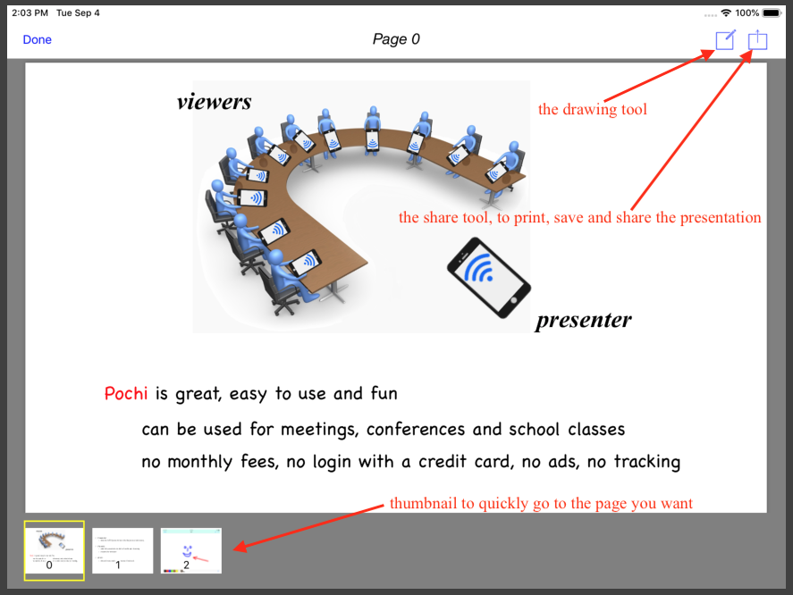
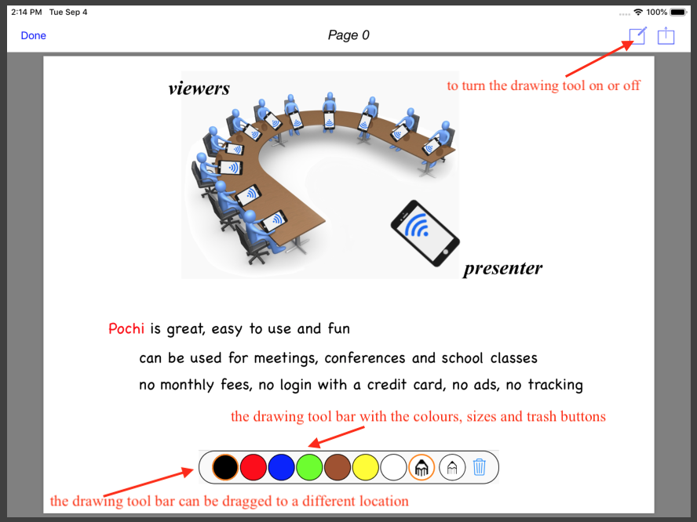
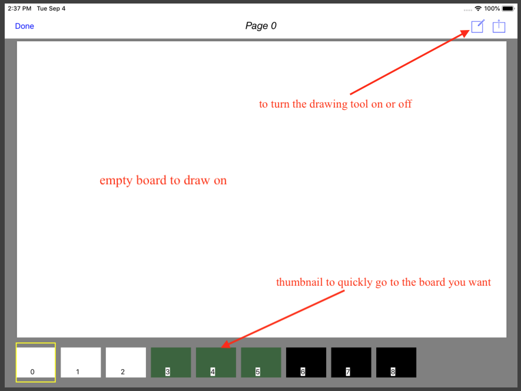

**Pochi** allows a presenter with an iPad or iPhone to share a presentation with a number of other iPads and iPhones. 
As the presenter flips through the presentation pages, the viewers device instantly receive the updated pages.

**Pochi** is really two applications, one is the **Pochi Presenter** App and the other is the **Pochi Viewer** App.
The **Pochi Presenter** App is used by presenters to share and interact with their presentation, and 
the **Pochi Viewer** App is used only to view the presentation.

The **Pochi Presenter** App always includes the **Pochi Viewer** App. With the **Pochi Presenter** App, 
a presenter selects a presentation from the device files folder, iCloud, DropBox or other storage, 
and press the **Start** button. The **Pochi Viewer** App is then presented with the presentation 
name for the viewer to follow.

## The presenter App

A presentation can be created using tools such as *Apple Pages* or *Microsoft PowerPoint*.
That presentation must be saved as a PDF document for **Pochi Presenter** to use.
In addition photos with format *png, jpg, gif or tif* can also be loaded individually. 
A presentation name with a gray background indicates the presentation is selected. 
To deselect a presentation simply tap the selection again. 

With a presentation selected, pressing the **Start** button will display the presentation 
and broadcast its presence to the **Pochi Viewer** Apps. 

A presentation can be annotated using the drawing tool provided when pressing the draw tool icon.

When no presentation is selected and the **Start** button is pressed, **Pochi Presenter** will display a 
collection of whiteboards for the presenter to draw on using the draw tool provided.

## The viewer App

The **Pochi Viewer** App receives the presentation initiated by the **Pochi Presenter** App.
It is used to passively view the presentation.

 