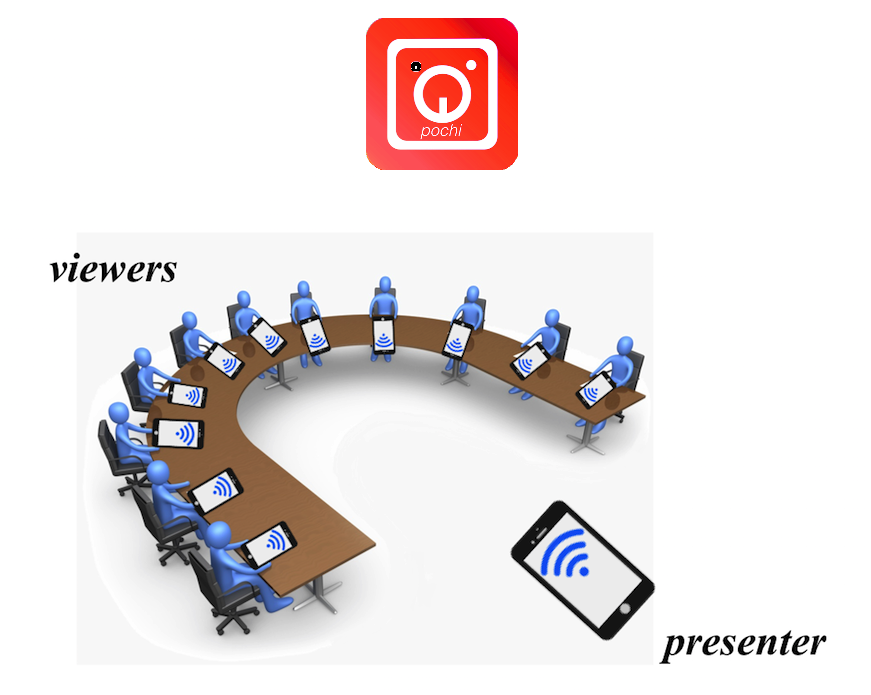
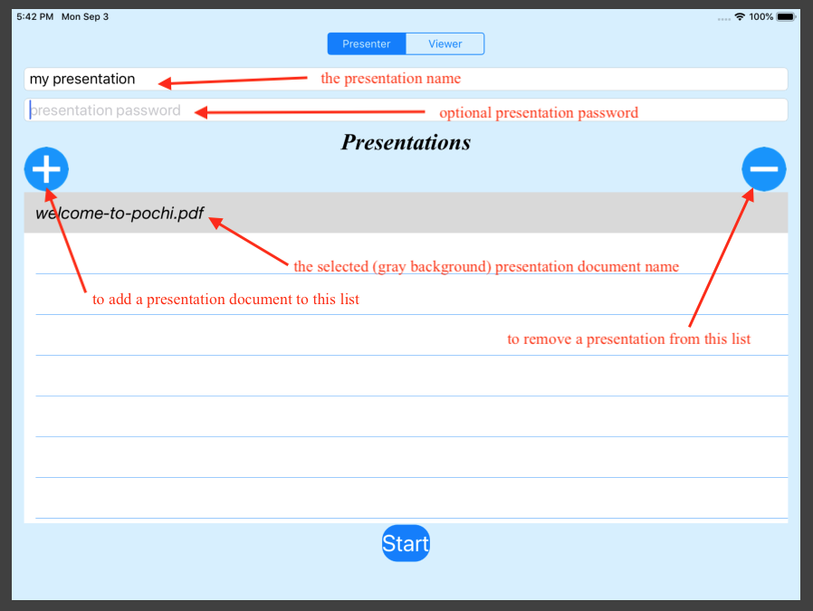

**Pochi** allows a presenter with an iPad or iPhone to share a presentation with a number of other viewer devices. 
As the presenter flips through the presentation pages, the viewers instantly receive the updated pages.

**Pochi** is really two applications, one is the **presenter** App and the other is the **viewer** App.

With the **presenter** App, a presenter selects a presentation from the device files folder, iCloud, DropBox or other storage, 
and press the start button. The **viewer** App is then shown that presentation for viewers to follow.

## The presenter App

 