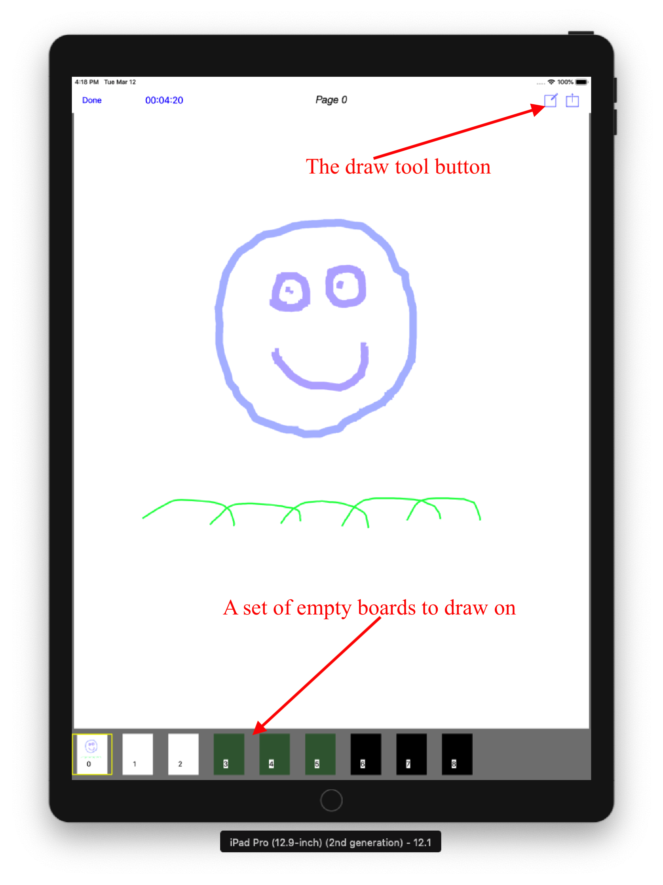
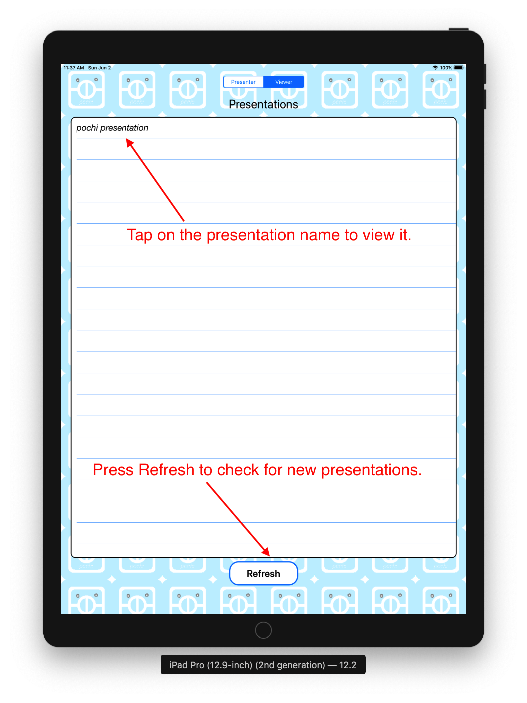

**Pochi** allows a presenter with an iPad, iPhone or a Mac to share a presentation with other iPads, iPhones and Macs in the audience. 
As the presenter flips through the presentation pages, the viewer devices instantly and securely receive the updated pages.

**Pochi** is really two applications talking to each other, one is the **Pochi Presenter** App and the other is the free **Pochi Viewer** App.
The **Pochi Presenter** App is used by presenters to share and interact with their presentation, and 
the **Pochi Viewer** App is used by the audience to view the presentation.
Both Apps need to be connected to the same local *Wi-Fi* network to work with each other.

With the **Pochi Presenter** App, 
a presenter starts by selecting a presentation document from the device *Files folder, iCloud, Dropbox* or other storage. The **Pochi Viewer** App is then able to follow that presentation 
by selecting it from a list.

#### For iPad and iPhone

The **Pochi Viewer** App for iOS is *free* and will soon be available from the [Apple Store]().
The **Pochi Viewer** App for iOS includes a trial *Presenter* function that is disabled after *7 days*.

The **Pochi Presenter** App for iOS cost **USD $4.99** and will soon be available from the [Apple Store]().
This **Pochi Presenter** App includes the **Pochi Viewer** App. 

### Pochi Presenter for iOS-12 is in testing phase, you can download it here for free 
### [Pochi Presenter iOS App download](https://testflight.apple.com/join/YgGfrqP1)

#### For Mac

The **Pochi Presenter** App for Mac is *free* and will soon be available from the [Apple Store]().
This **Pochi Presenter** App includes the **Pochi Viewer** App. 

### [Pochi Presenter Mac test App download](files/pochi.app.zip)

# The Presenter App

A presentation can be created using a number of tools such as *Apple Keynote, Pages or Preview*, *Microsoft PowerPoint* or 
*Adobe PDF tools*.
That presentation must be saved as a PDF document for **Pochi Presenter** to use.
In addition photos with format *png, jpg, jpeg, gif or tif* can also be loaded individually. 
A presentation can optionally require a password. When a password is set, **Viewers** will be asked 
for that password in order to view the presentation. The communication between the **Presenter**
and the **Viewers** is made secure in this case.

To select a presentation press the **Presentation** button and navigate to the document you want. 
Once a PDF document is selected the presentation will be displayed and will broadcast 
its presence to the **Pochi Viewer** Apps using the local *Wi-Fi* network. 

Different pages can be selected using the thumbnail bar or by swiping left and right.
 
A presentation can be annotated using the drawing tool provided after pressing the draw tool icon.

When the **Whiteboard** button is pressed, **Pochi Presenter** will display a 
collection of empty whiteboards for the presenter to draw on using the drawing tool. The boards 
consist of 3 whiteboards, 3 chalkboards and 3 blackboards.

When not in drawing mode, tapping on the presentation or whiteboard will hide or show the navigation bar 
and the thumbnail pages, however swiping left and right to change page remains active.

# The Viewer App

The **Pochi Viewer** App receives the presentation initiated by the **Pochi Presenter** App, it is used to passively view the presentation. 

The main page of the **Pochi Viewer** App shows a list of active presentations. 
The user selects the presentation to follow by tapping on the desired presentation name.

It takes a few seconds for a presentation to appear in the list. If a presentation is expected, 
but it is not shown in the list, try pressing the **Refresh** button.
 

Once a presentation is selected, the current page will be displayed and the App will download the full presentation in the background. 
The number of pages downloaded to date is displayed next to the presentation name. 
When all pages have been downloaded, only the title name will be displayed.
 

The **Pochi Viewer** App also allows for printing, saving and sharing of the presentation by pressing 
the **share** button. Note that these functions will use the current number of pages downloaded to date.
 
# Pochi assist

Please address all correspondence regarding the **Pochi** Apps to: <pochi.assist@gmail.com>

# Privacy Policy
 
The following *Privacy Policy* applies to **Pochi Presenter** and **Pochi Viewer** (the Apps) for iOS and macOS.
 
##### Information Collection, Use, and Sharing
 
**Pochi Presenter** and **Pochi Viewer** Apps do not:
 
 * collect, access or record any personal information,
 * collect, access or record any location information,
 * collect, access or record any other information,
 * contain any In-App purchase,
 * display any advertising,
 * ask for credit card number, 
 * ask for login information,
 * lock you into subscription.
   
 We only have access to information that you voluntarily give us via email 
 or other direct contact from you. We will not sell or rent this information to anyone.
 
 We will use your information to respond to you, regarding the reason you contacted us. 
 We will not share your information with any third party outside of our organization, 
 other than as necessary to fulfill your request.
 
 Unless you ask us not to, we may contact you via email in the future to answer your 
 questions regarding the **Apps** 
 or changes to this privacy policy.
 
##### Your Access to and Control Over Information 
 
You may opt out of any future contacts from us at any time. 
 
If you feel that we are not abiding by this privacy policy, you should contact us 
immediately via email <pochi.assist@gmail.com>.
 